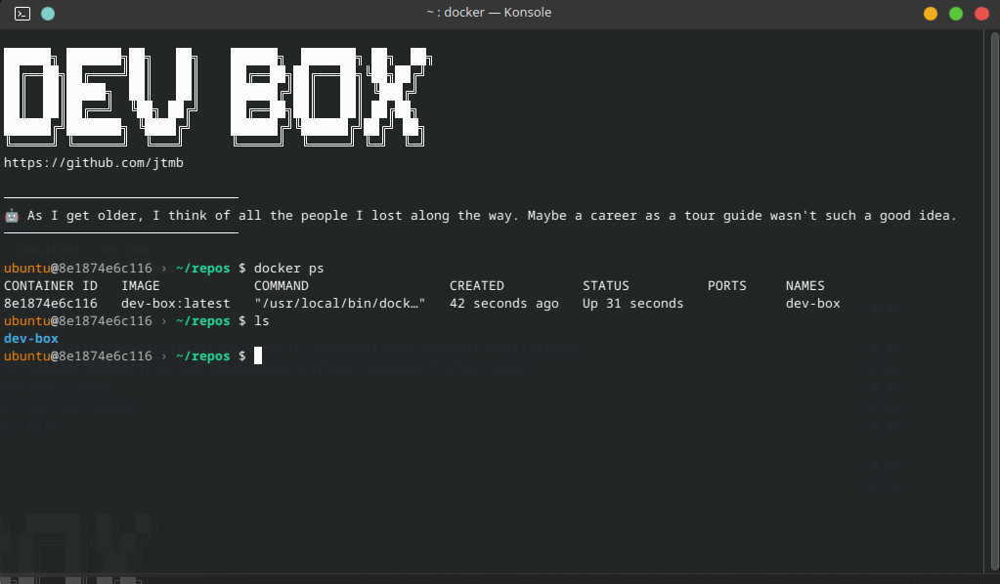
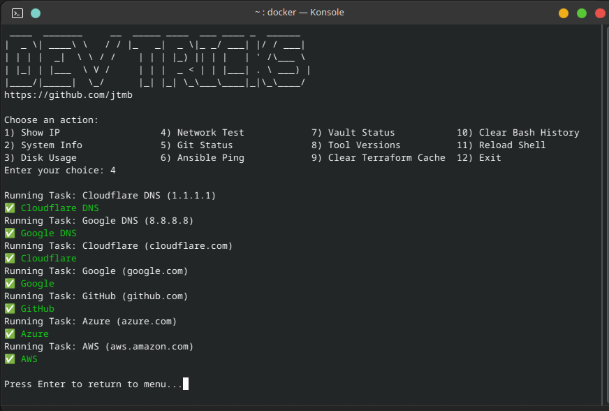

<h1 align="center">
  <a href="https://github.com/jtmb">
    
  </a>
</h1>

<h1 align="center">🚀 DEV-BOX 🐧</h1>

<div align="center">
  <b>dev-box</b> — A Docker-based Ubuntu DevOps environment for local development, automation, and tool experimentation. 🛠️🐳
</div>

---


## Table of Contents

- [📖 Overview](#overview)
- [✨ Features](#features)
- [🧩 Architecture](#architecture)
- [⚡ Setup](#setup)
- [🛠️ Troubleshooting](#troubleshooting)
- [🗂️ File Structure](#file-structure)
- [🎨 Customization](#customization)
- [🤝 Contributing](#contributing)
- [📄 License](#license)

---


## Overview

dev-box provides a reproducible, containerized Ubuntu environment for DevOps, automation, and tool testing. It leverages Docker Compose and VS Code devcontainers for a seamless developer experience, with pre-installed tools like Ansible, Terraform, and Vault. 🧰

<div align="center">
  
</div>

---


## Features

- 🐧 Ubuntu 24.04 base image
- ⚙️ Pre-installed: Ansible, Terraform, Vault, Python, Git, and more
- 🖥️ User-friendly launcher with menu-driven actions
- 💾 Persistent home directory via Docker volume
- 🧑‍💻 Devcontainer support for VS Code integration
- 🎨 Customizable shell themes and aliases
- 🔒 Secure secrets and SSH directory setup
- 🐳 Docker-in-Docker support (optional)
- 🦸 Includes dev-tricks - a custom built devops menu-driven TUI for dev-box
- 📏 240 MB docker image size
- 😜 NEW* Includes cheeky startup messages. (Can be disabled in config.)


## Architecture

- 📦 **Dockerfile**: Builds the base image with all required tools and user setup
- 📝 **docker-compose.yml**: Defines the container service, volumes, and environment
- 🧑‍💻 **.devcontainer/**: VS Code devcontainer configuration for remote development
- 🖥️ **launcher.sh**: Interactive menu for common tasks (IP display, setup, themes, etc.) **in progress**
- 🏁 **docker-init.sh**: Container entrypoint for user, permissions, and environment setup
- 📁 **/src**: Place for additional scripts, images, or resources


## Setup


### Prerequisites
- 🐳 Docker & Docker Compose installed
- 💻 (Optional) Visual Studio Code with Remote - Containers extension


### Quick Start

```sh
./compose-up.sh
```
This will build the image, start the container, and drop you into a shell as the `ubuntu` user. 🐧

Or build manually:
```sh
docker compose up --build -d # build the stack
docker exec -it dev-box bash # exec into the dev-box container interactive bash shell
```


### VS Code Devcontainer

Open the folder in VS Code and reopen in container for a full-featured development environment. 🦾


## Usage: dev-tricks-launcher

`dev-tricks-launcher.sh` is a menu-driven TUI (Text User Interface) tool designed to simplify common DevOps and development tasks inside the dev-box container. It provides a convenient, interactive way to access system information, manage tools, and perform routine operations without memorizing commands. 🤓

**Key Features:**
- 🌐 View local and public IP addresses
- 🖥️ Check system info and disk usage
- 📡 Run network tests
- 🔍 View Git status
- 🏹 Ping Ansible inventory
- 🏦 Check Vault status
- 🛠️ Show tool versions (Terraform, Ansible, Vault, Git)
- 🧹 Clear Terraform cache or Bash history
- 🔄 Reload the shell environment

<div align="center">
  
</div>


**Usage:**

To launch the Dev-Tricks TUI, simply type:

```sh
launcher
```

Or run the script directly:

```sh
src/dev-tricks-launcher.sh
```

🕹️ Follow the on-screen menu to select and execute actions.


## Troubleshooting

- 🐳 If the container fails to start, ensure Docker is running and you have permission to access the Docker socket.
- 🔑 For permission issues, rerun `docker-init.sh` or check volume mounts.
- ♻️ To rebuild from scratch:
  ```sh
  docker rm -f dev-box
  docker image rm dev-box:latest
  ./compose-up.sh
  ```


## File Structure

```
dev-box/
├── Dockerfile 🐧
├── docker-compose.yml 🐳
├── compose-up.sh 🚀
├── launcher.sh 🕹️
├── docker-init.sh 🏁
├── .devcontainer/ 🧑‍💻
│   └── devcontainer.json
├── src/
│   └── image.png 🖼️
└── README.md 📄
```


## Customization

- ✏️ Edit `Dockerfile` to add/remove tools
- 🛠️ Adjust `docker-compose.yml` for volumes or environment
- 🕹️ Modify `launcher.sh` to add menu actions
- 🧑‍💻 Tweak `.devcontainer/devcontainer.json` for VS Code settings
- 📜 Place custom scripts in `/src` or `/scripts`


## Contributing

First off, thanks for taking the time to contribute! 🙏 Contributions are what makes the open-source community such an amazing place to learn, inspire, and create. Any contributions you make will benefit everybody else and are **greatly appreciated**. 🎉

Please try to create bug reports that are:

- 🐞 _Reproducible._ Include steps to reproduce the problem.
- 📋 _Specific._ Include as much detail as possible: which version, what environment, etc.
- 🆕 _Unique._ Do not duplicate existing opened issues.
- 🎯 _Scoped to a Single Bug._ One bug per report.


## License

This project is licensed under the **GNU GENERAL PUBLIC LICENSE v3**. Feel free to edit and distribute this template as you like. 📝

See [LICENSE](LICENSE) for more information. 📚


